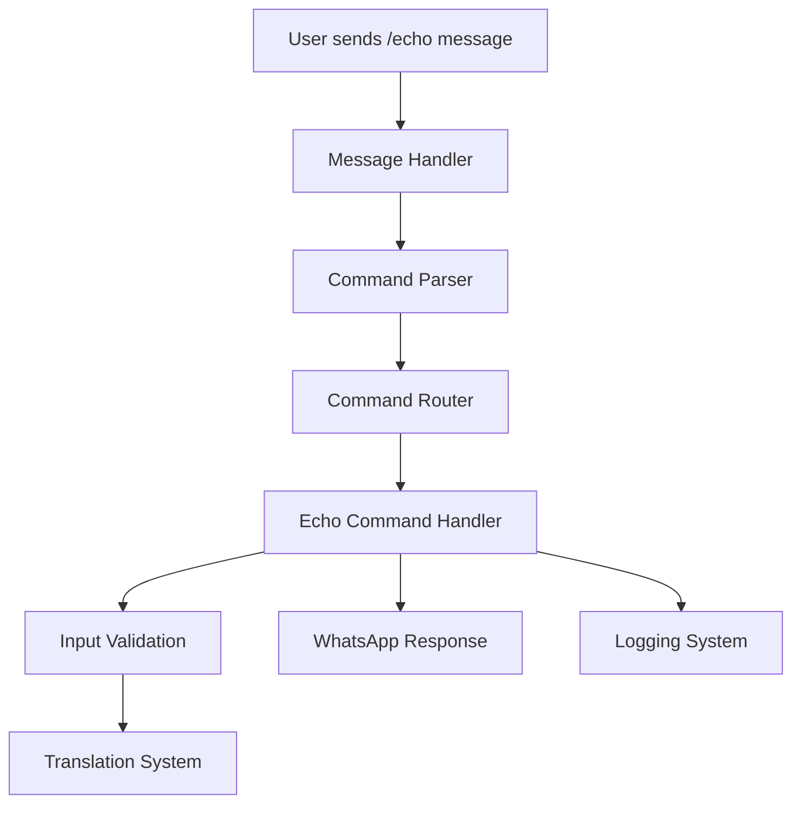

# Miau Bot Command Development Guide

## Creating an Echo Command with Full Internationalization Support

This comprehensive guide demonstrates how to create a new command in the Miau bot system using the echo command as a practical example. You'll learn to implement proper internationalization (i18n), error handling, logging, and follow established architectural patterns.

### Table of Contents

1. [Overview](#overview)
2. [Prerequisites](#prerequisites)
3. [Architecture Understanding](#architecture-understanding)
4. [Step-by-Step Implementation](#step-by-step-implementation)
5. [Testing and Validation](#testing-and-validation)
6. [Best Practices](#best-practices)
7. [Logging Standards](#logging-standards)
8. [Advanced Features](#advanced-features)
9. [Troubleshooting](#troubleshooting)
10. [Performance Considerations](#performance-considerations)

---

## Overview

The echo command serves as an excellent introduction to the bot's command system. It will:

- **Respond to `/echo [message]`** with the user's message repeated back
- **Handle empty messages** with helpful prompts
- **Support multiple languages** (English, Spanish, Portuguese)
- **Implement proper error handling** with comprehensive logging
- **Follow established architectural patterns** for maintainability

### Expected Behavior

```
User: /echo Hello World!
Bot: 🔄 Echo: Hello World!

User: /echo
Bot: Please provide a message to echo. Usage: /echo [message]
```

---

## Prerequisites

Before implementing your command, ensure you understand:

- **TypeScript fundamentals** and async/await patterns
- **Baileys WhatsApp library** basic concepts
- **Project structure** and module organization
- **i18n system** using the translation key-value approach

### Required Dependencies

The following dependencies are already available in the project:

- `baileys` - WhatsApp Web API
- `typescript` - Type safety and modern JavaScript features
- Built-in logging system with structured output

---

## Architecture Understanding

### Command Flow



### Key Components

1. **Translation System**: Centralized i18n with fallback support
2. **Command Router**: Maps command names to handlers
3. **Input Validation**: Ensures proper command usage
4. **Error Handling**: Consistent error responses and logging
5. **Type Safety**: Full TypeScript integration

---

## Step-by-Step Implementation

### Step 1: Create Command Translations

Create the translation file that will support all languages:

**File: `src/i18n/translations/commands/echo.ts`**

```typescript
export const echoTranslations = {
  en: {
    // Command metadata for help system
    name: "echo",
    description: "Repeat the provided message back to you",
    usage: "/echo [message]",

    // Response messages
    prefix: "🔄 Echo:",
    noMessage: "Please provide a message to echo.",
    usageHelp: "Usage: /echo [message]",
    example: "Example: /echo Hello World!",

    // Error messages
    tooLong: "Message is too long. Maximum {max} characters allowed.",
    invalidContent: "Message contains invalid content.",
  },
  es: {
    name: "eco",
    description: "Repite el mensaje proporcionado de vuelta",
    usage: "/echo [mensaje]",

    prefix: "🔄 Eco:",
    noMessage: "Por favor proporciona un mensaje para repetir.",
    usageHelp: "Uso: /echo [mensaje]",
    example: "Ejemplo: /echo ¡Hola Mundo!",

    tooLong:
      "El mensaje es demasiado largo. Máximo {max} caracteres permitidos.",
    invalidContent: "El mensaje contiene contenido inválido.",
  },
  pt: {
    name: "eco",
    description: "Repete a mensagem fornecida de volta para você",
    usage: "/echo [mensagem]",

    prefix: "🔄 Eco:",
    noMessage: "Por favor forneça uma mensagem para repetir.",
    usageHelp: "Uso: /echo [mensagem]",
    example: "Exemplo: /echo Olá Mundo!",

    tooLong: "A mensagem é muito longa. Máximo {max} caracteres permitidos.",
    invalidContent: "A mensagem contém conteúdo inválido.",
  },
} as const;
```

### Step 2: Register Translations

Update the main translation index to include your new command:

**File: `src/i18n/translations/index.ts`**

```typescript
// Add import at the top
import { echoTranslations } from "./commands/echo";

// Update the buildLanguageTranslations function
const buildLanguageTranslations = (lang: Language) => {
  const coreTranslations = {
    en: enTranslations,
    es: esTranslations,
    pt: ptTranslations,
  }[lang];

  const commandTranslations = {
    help: helpTranslations[lang],
    audio: audioTranslations[lang],
    sticker: stickerTranslations[lang],
    video: videoTranslations[lang],
    echo: echoTranslations[lang], // Add this line
  };

  return {
    ...coreTranslations,
    ...commandTranslations,
  };
};
```

### Step 3: Implement Command Handler

Create the main command logic with comprehensive error handling:

**File: `src/commands/echo.ts`**

```typescript
import { WAMessage, WASocket } from "baileys";
import { logger } from "../config/logger";
import t from "../i18n";

/**
 * Handles the echo command execution
 * Repeats the user's message back to them with validation
 *
 * @param socket - WhatsApp socket connection
 * @param message - Original message that triggered the command
 * @param args - Command arguments (the message to echo)
 * @returns Promise<void>
 */
export async function handleEchoCommand(
  socket: WASocket,
  message: WAMessage,
  args: string[]
): Promise<void> {
  const jid = message.key.remoteJid!;
  const userMessage = args.join(" ").trim();

  try {
    logger.debug("Executing echo command", {
      jid,
      messageLength: userMessage.length,
      user: message.pushName || "Unknown",
    });

    // Validate input
    const validationResult = validateEchoInput(userMessage);
    if (!validationResult.isValid) {
      await sendValidationError(socket, jid, validationResult.error!);
      return;
    }

    // Send the echoed message
    const echoResponse = `${t("echo.prefix")} ${userMessage}`;

    await socket.sendMessage(jid, {
      text: echoResponse,
    });

    // Log successful command execution
    logger.success("Echo command executed successfully", {
      jid,
      messageLength: userMessage.length,
      user: message.pushName || "Unknown",
    });
  } catch (error) {
    // Comprehensive error handling with detailed logging
    const errorMessage = error instanceof Error ? error.message : String(error);

    logger.error("Error executing echo command", {
      error: errorMessage,
      jid,
      user: message.pushName || "Unknown",
      messageLength: userMessage.length,
      stack: error instanceof Error ? error.stack : undefined,
    });

    // Send user-friendly error message
    try {
      await socket.sendMessage(jid, {
        text: t("core.commandError"),
      });
    } catch (sendError) {
      logger.error("Failed to send error message", {
        originalError: errorMessage,
        sendError:
          sendError instanceof Error ? sendError.message : String(sendError),
        jid,
      });
    }
  }
}

/**
 * Validates the input for the echo command
 * @param message - The message to validate
 * @returns Validation result with success/error information
 */
function validateEchoInput(message: string): {
  isValid: boolean;
  error?: string;
} {
  // Check if message is empty
  if (!message || message.length === 0) {
    return {
      isValid: false,
      error: "empty",
    };
  }

  // Check message length (WhatsApp has a limit)
  const maxLength = 4096; // WhatsApp's character limit
  if (message.length > maxLength) {
    return {
      isValid: false,
      error: "tooLong",
    };
  }

  // Check for potentially problematic content
  if (containsInvalidContent(message)) {
    return {
      isValid: false,
      error: "invalidContent",
    };
  }

  return { isValid: true };
}

/**
 * Checks if the message contains invalid content
 * @param message - The message to check
 * @returns True if content is invalid
 */
function containsInvalidContent(message: string): boolean {
  // Add any content validation logic here
  // For example, check for excessive special characters, etc.

  // Simple check for excessive repetition (spam protection)
  const repeatedCharPattern = /(.)\1{50,}/; // 50+ repeated characters
  return repeatedCharPattern.test(message);
}

/**
 * Sends appropriate validation error message to the user
 * @param socket - WhatsApp socket connection
 * @param jid - Chat identifier
 * @param errorType - Type of validation error
 */
async function sendValidationError(
  socket: WASocket,
  jid: string,
  errorType: string
): Promise<void> {
  let errorMessage = "";

  switch (errorType) {
    case "empty":
      errorMessage = `${t("echo.noMessage")}\n${t("echo.usageHelp")}\n${t(
        "echo.example"
      )}`;
      break;
    case "tooLong":
      errorMessage = t("echo.tooLong", { max: "4096" });
      break;
    case "invalidContent":
      errorMessage = t("echo.invalidContent");
      break;
    default:
      errorMessage = t("core.commandError");
  }

  await socket.sendMessage(jid, {
    text: errorMessage,
  });

  logger.info("Echo command validation error", {
    jid,
    errorType,
  });
}
```

### Step 4: Register the Command

Add your command to the main command registry:

**File: `src/commands/index.ts`**

```typescript
// Add import at the top
import { handleEchoCommand } from "./echo";

// Add the command definition before the export
const echo: Command = {
  name: "echo",
  description: t("echo.description"),
  usage: t("echo.usage"),
  execute: async (socket: WASocket, message: WAMessage, args: string[]) => {
    await handleEchoCommand(socket, message, args);
  },
};

// Add to the commands export object
export const commands: Record<string, Command> = {
  help,
  sticker,
  s: sticker, // Alias for sticker
  audio,
  video,
  echo, // Add your new command
  e: echo, // Optional: Add alias for quick access
  repeat: echo, // Alternative descriptive name
};
```

---

## Testing and Validation

### Manual Testing Checklist

1. **Basic Functionality**

   - [ ] `/echo Hello World` responds with "🔄 Echo: Hello World"
   - [ ] `/echo` shows usage help message
   - [ ] Command works in private chats
   - [ ] Command works in group chats

2. **Input Validation**

   - [ ] Empty message shows helpful error
   - [ ] Very long message (4000+ chars) shows length error
   - [ ] Messages with excessive repeated characters are handled

3. **Internationalization**

   - [ ] Test with `BOT_LANGUAGE=en`
   - [ ] Test with `BOT_LANGUAGE=es`
   - [ ] Test with `BOT_LANGUAGE=pt`
   - [ ] Verify fallback to English for invalid language codes

4. **Error Scenarios**

   - [ ] Test with network issues (if possible)
   - [ ] Verify error messages are user-friendly
   - [ ] Check logs for proper error recording

5. **Edge Cases**
   - [ ] Messages with only spaces
   - [ ] Messages with emojis and special characters
   - [ ] Messages with line breaks
   - [ ] Very short messages (single character)

### Sample Test Messages

```bash
# Basic functionality
/echo Hello World!
/echo Testing 123
/echo 🎉 Emojis work too! 🎉

# Edge cases
/echo
/echo    (spaces only)
/echo A
/echo This is a very long message that contains many words and should still work properly within the character limits
```

---

## Best Practices

### Code Quality

1. **Type Safety**

   ```typescript
   // Always use proper typing for function parameters
   export async function handleEchoCommand(
     socket: WASocket,
     message: WAMessage,
     args: string[]
   ): Promise<void> {
     // Implementation
   }
   ```

2. **Input Validation**

   ```typescript
   // Always validate user input before processing
   function validateEchoInput(message: string): ValidationResult {
     if (!message?.trim()) {
       return { isValid: false, error: "empty" };
     }
     // Additional validation...
     return { isValid: true };
   }
   ```

3. **Error Handling**

   ```typescript
   try {
     // Command logic
   } catch (error) {
     // Always log errors with context
     logger.error("Command failed", {
       error: error instanceof Error ? error.message : String(error),
       context: { jid, user, messageLength },
     });
   }
   ```

### Security Considerations

1. **Input Sanitization**

   ```typescript
   // Prevent spam and abuse
   function containsInvalidContent(message: string): boolean {
     // Check for excessive repetition
     const repeatedCharPattern = /(.)\1{50,}/;
     return repeatedCharPattern.test(message);
   }
   ```

### Internationalization Best Practices

1. **Consistent Key Naming**

   ```typescript
   // Use hierarchical naming convention
   "echo.prefix"; // ✅ Good
   "echo.noMessage"; // ✅ Good
   "echo.EchoPrefix"; // ❌ Avoid
   "echo.no_message"; // ❌ Inconsistent
   ```

2. **Placeholder Usage**

   ```typescript
   // Use named placeholders for dynamic content
   t("echo.tooLong", {
     max: "4096",
   }) // ✅ Good
   `Message too long. Max ${max} chars`; // ❌ Not translatable
   ```

3. **Context-Aware Translations**
   ```typescript
   // Provide clear context in your translation keys
   "echo.usageHelp"; // ✅ Clear context
   "usage"; // ❌ Too generic
   ```

---

### Logging Standards

```typescript
// Use appropriate log levels
logger.debug("Debug information for development");
logger.info("General information about command execution");
logger.warn("Warning about potential issues");
logger.error("Error that needs attention");
logger.success("Successful completion of important operations");
```

---

## Advanced Features

### Adding Message Formatting

```typescript
// Add different echo modes
export async function handleEchoCommand(
  socket: WASocket,
  message: WAMessage,
  args: string[]
): Promise<void> {
  const mode = args[0]?.toLowerCase();
  const userMessage = args.slice(1).join(" ").trim();

  switch (mode) {
    case "--upper":
      echoResponse = userMessage.toUpperCase();
      break;
    case "--lower":
      echoResponse = userMessage.toLowerCase();
      break;
    case "--reverse":
      echoResponse = userMessage.split("").reverse().join("");
      break;
    default:
      // Treat first arg as part of message if no mode specified
      echoResponse = args.join(" ").trim();
  }

  // Continue with normal processing...
}
```

### Enhanced Validation

```typescript
// More sophisticated content validation
function validateEchoInput(message: string): ValidationResult {
  // Check for empty message
  if (!message?.trim()) {
    return { isValid: false, error: "empty" };
  }

  // Check length limits
  if (message.length > 4096) {
    return { isValid: false, error: "tooLong" };
  }

  // Check for spam patterns
  if (isSpamMessage(message)) {
    return { isValid: false, error: "spam" };
  }

  // Check for potentially harmful content
  if (containsHarmfulContent(message)) {
    return { isValid: false, error: "harmful" };
  }

  return { isValid: true };
}

function isSpamMessage(message: string): boolean {
  // Check for excessive repetition
  const repeatedCharPattern = /(.)\1{20,}/;
  const repeatedWordPattern = /\b(\w+)(\s+\1){10,}/i;

  return repeatedCharPattern.test(message) || repeatedWordPattern.test(message);
}
```

---

## Troubleshooting

### Common Issues and Solutions

1. **Translation Not Found**

   ```
   Error: Translation key 'echo.prefix' not found
   ```

   **Solution**: Verify the translation key exists in all language files and is properly registered in `index.ts`.

2. **Command Not Recognized**

   ```
   Bot responds: "Command 'echo' not found"
   ```

   **Solution**: Check that the command is properly registered in `src/commands/index.ts` and exported correctly.

3. **Empty Args Array**

   ```
   Error: Cannot read property '0' of undefined
   ```

   **Solution**: Always check if args exist and have content before accessing array elements:

   ```typescript
   const userMessage = args?.join(" ").trim() || "";
   ```

4. **Message Too Long Error**
   **Solution**: Ensure your validation correctly handles WhatsApp's character limits and provides helpful feedback.

### Debugging Steps

1. **Enable Debug Logging**

   ```bash
   # Set LOG_LEVEL to debug in your environment
   LOG_LEVEL=debug npm run dev
   ```

2. **Check Translation Registration**

   ```typescript
   // Add temporary debug logging
   console.log("Available translations:", Object.keys(translations.en));
   console.log("Echo translations:", translations.en.echo);
   ```

3. **Verify Command Registration**

   ```typescript
   // Add temporary debug logging
   console.log("Registered commands:", Object.keys(commands));
   ```

4. **Debug Args Parsing**
   ```typescript
   // Add logging to see how args are parsed
   logger.debug("Command args", { args, joinedArgs: args.join(" ") });
   ```

---

## Performance Considerations

### Response Time Optimization

```typescript
// Use efficient string operations
const echoResponse = `${t("echo.prefix")} ${userMessage}`;

// Avoid unnecessary async operations for simple text processing
// Process validation synchronously when possible
```

### Scalability Considerations

- **Stateless Design**: Command handlers don't maintain state between invocations
- **Concurrent Safety**: Each command execution is isolated
- **Resource Limits**: Built-in protection against excessive message lengths

---

## Conclusion

You've successfully implemented a fully-featured echo command with:

- ✅ **Complete internationalization support**
- ✅ **Comprehensive input validation and error handling**
- ✅ **Type safety and modern TypeScript patterns**
- ✅ **Security considerations and spam protection**
- ✅ **Extensible architecture for future enhancements**
- ✅ **Detailed logging and debugging capabilities**

This echo command serves as an excellent foundation for understanding:

- **Command argument handling** - Working with user input
- **Input validation** - Ensuring data quality and security
- **Error handling patterns** - Graceful failure management
- **Internationalization** - Multi-language support
- **Logging strategies** - Debugging and monitoring

The patterns demonstrated here can be applied to create more sophisticated commands while maintaining code quality, user experience, and system reliability.

For additional support or questions about the bot framework, refer to the project documentation or reach out to the development team.
